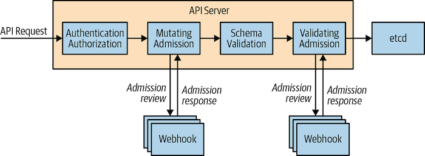

# mutating-wh

Mutating admission [webhook](https://kubernetes.io/docs/reference/access-authn-authz/extensible-admission-controllers/#admission-webhooks). Based on https://github.com/pete911/template-wh.



End to end test:

```
make e2e-test
```
